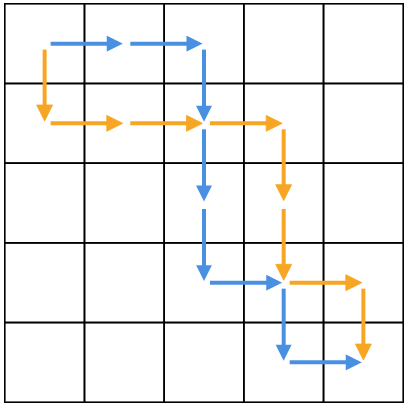

## You Can Go Your Own Way(5점, 9점, 10점)

#### Problem  
당신은 지금 세계에서 가장 쉬운 미로에 들어오셨습니다.  
당신은 북쪽 N by N 그리드의 북서쪽 셀에서 시작하여 남동쪽 셀에 도달해야만 합니다.  
사용할 수있는 이동 유형은 두 가지뿐입니다. 유닛은 동쪽으로 이동하고 유닛은 남쪽으로 이동합니다.   
어떤 셀로도 이동할 수 있지만 그리드를 벗어나는 이동을 할 수는 없습니다.

당신은 세계 최초로 미로를 해결한다는 사실에 신나겠지만, 그때 당신은 발자국을 보게 됩니다.  
당신의 라이벌인 Labyrinth Lydia는 위에 서술된 대로 당신이 사용하는 룰과 동일하게 당신보다 먼저 이미 이 미로를 풀었습니다.

독창적인 사상가로서 당신은 Lydia의 이동 방법을 재사용하고 싶지 않습니다.  
구체적으로 말하자면, 그녀의 경로가 어떤 셀 A에서 인접한 셀 B 로의 단위 이동을 포함한다면,  
당신의 경로는 A에서 B 로의 이동을 포함 할 수 없습니다.   
(그러나,이 경우 당신이 A에서 B로 가지 않는 한 경로가 A를 방문하거나 B를 방문하는 것은 가능합니다.)   
그런 경로를 찾으십시오.

다음 그림에서 Lydia의 경로는 파란색으로 표시되고 유효한 경로는 주황색으로 표시됩니다.

#### Input

입력의 첫 번째 줄은 테스트 케이스의 수를, T. T 테스트 케이스는 다음을 제공합니다.  
각 경우는 두 줄로 구성됩니다. 첫 번째 줄에는 위에 설명 된대로 미로의 크기를 나타내는 하나의 정수 N이 포함됩니다.   
두 번째 줄에는 2N - 2 자의 문자열 P가 포함되어 있습니다.   
각 문자는 대문자 E (동쪽의 경우) 또는 대문자 S (남쪽 인 경우)이며 미로를 통과하는 Lydia의 유효한 경로를 나타냅니다.  

#### Output

각 테스트 케이스에 대해 Case #x : y를 포함하는 한 줄을 출력합니다.   
여기서 x는 테스트 케이스 번호 (1부터 시작)이고 y는 2N - 2 문자의 문자열입니다.   
각 문자는 대문자 E (동쪽의 경우) 또는 대문자 Lydia의 경로와 충돌하지 않는 미로를 통해 올바른 경로를 나타내는 S (남쪽). 최소한 하나의 대답이 존재한다는 보장이 있습니다.

#### Limits
1 ≤ T ≤ 100.  
Time limit: 테스트셋당 15초.  
Memory limit: 1GB.  
P는 정확히 N - 1 자의 문자와 정확하게 N - 1 S자를 포함합니다.  

#### Test set 1 (Visible)
2 ≤ N ≤ 10.

#### Test set 2 (Visible)
2 ≤ N ≤ 1000.

#### Test set 3 (Hidden)
For at most 10 cases, 2 ≤ N ≤ 50000.  
For all other cases, 2 ≤ N ≤ 10000.

#### Sample

|Input|Output| 
|-----|-----|
|2||
|2||
|SE|Case #1: ES|
|5||
|EESSSESE|Case #2: SEEESSES|

  

Sample Case # 1에서는 미로가 너무 작아서 유효한 해결책이 하나만 남았습니다.

Sample Case # 2는 위 그림과 일치합니다. 경로가 교차하는 것은 허용됩니다.